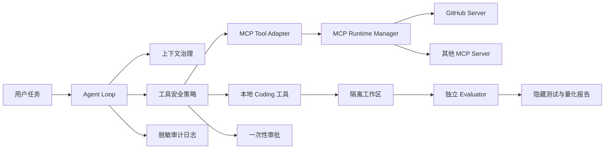

# CoreCoder 央国企简历与面试表达

## 一、项目定位

CoreCoder 是一个面向研发辅助场景的可控型 Coding Agent。它能够根据自然语言任务读取代码、执行工具、修改文件、运行测试并根据失败结果继续修复；同时通过 MCP 接入 GitHub 等外部系统。

项目重点不是复刻大型商业 IDE，而是研究企业内部使用 Agent 时必须解决的几个工程问题：长连接稳定性、故障隔离、上下文治理、权限边界、操作审计与结果验收。

## 二、为什么适合央国企技术岗位

央国企内部系统通常更关注稳定运行、数据边界、操作留痕、国产或内网模型适配以及明确的验收标准。CoreCoder 可以围绕以下价值展开：

- 兼容 OpenAI 风格接口，可切换 DeepSeek 或内网兼容模型。
- MCP Server 故障相互隔离，单服务异常不扩大到整个 Agent。
- 外部写操作默认需要审批，高风险行为直接禁止。
- 工具调用形成脱敏审计记录，便于定位责任和复盘。
- 使用固定任务集和隐藏测试验收，不依赖主观 Demo。
- 关键控制逻辑位于本地执行层，不把安全寄托在 Prompt 上。

## 三、架构说明

调用链可以简化为：用户提出任务，Agent 根据工具 Schema 选择工具；本地工具或 MCP 工具执行前先经过安全策略，执行过程写入审计日志；修改完成后由独立评测器运行隐藏测试，并检查文件修改范围和工具预算。

## 四、可以写进简历的版本

### 项目名称

CoreCoder——面向企业研发场景的可控型 Coding Agent

### 项目描述

基于 Python 实现 Coding Agent 执行框架，支持代码检索、文件编辑、命令测试、失败修复闭环，并通过 MCP 协议动态接入 GitHub 等外部能力；围绕企业级稳定性、安全性与可验收性完善运行时治理。

### 主要工作

1. 设计 MCP 长连接 Runtime 与多 Server Manager，实现工具动态发现、同步/异步桥接、调用超时、两阶段关闭、单服务重启、熔断器及并发舱壁，降低外部服务故障扩散风险。
2. 构建 Coding Agent 任务状态机与隔离式评测框架，通过独立隐藏测试、文件快照和工具预算验证任务结果，输出成功率、耗时、Token、成本及失败分类等可复现指标。
3. 实现分层上下文治理和结构化工作记忆，保留文件、错误、测试状态和用户目标，并记录压缩次数与估算节省 Token，支持上下文策略 A/B 对比。
4. 在执行层实现命令风险分级、工作区文件边界、一次性限时审批和 JSONL 脱敏审计；增加可插拔 Docker 沙箱，通过禁网、只读根文件系统及 CPU、内存、PID 限制降低命令影响范围。
5. 基于 SQLite 构建单机持久化任务台账，通过事务实现多 Worker 原子领取，引入租约心跳、过期回收、有限重试和两阶段取消；使用数据库唯一约束实现并发幂等提交，并支持任务优先级与旧 Schema 自动迁移。

### 当前验证数据

- 项目自动化测试：222 项通过（后续以仓库最新结果为准）。
- Coding Agent 固定评测案例：15 个，全部使用独立隐藏测试验收。
- 离线确定性演示：隐藏测试、文件范围和工具预算验收通过。
- 离线故障演练：Worker 失联、重试耗尽、取消竞态、并发幂等、审批重放共 5 类场景全部通过。

简历提交前应使用最新测试和真实模型评测结果更新数字，不要长期写死旧数据。

## 五、面试中的“问题—方案—结果”讲法

### MCP 稳定性

问题：标准 SDK 可以连续调用工具，但如果每次业务调用都重新创建连接，会重复握手；而长连接又带来事件循环归属、超时调用未结束和连接损坏等问题。

方案：使用 Owner Task 独占 MCP Client，通过线程安全命令队列桥接同步 Agent；增加状态机、超时隔离、两阶段关闭、恢复连接、熔断和并发舱壁。

结果：同一连接可以发现并调用多个工具，单个 Server 故障可以独立隔离和重启，不影响其他 Server。

### 上下文工程

问题：Coding Agent 的文件内容和测试日志会快速占满上下文，直接丢弃历史又可能遗失修改原因和当前错误。

方案：分层裁剪旧工具输出、安全摘要历史调用链、接近硬限制时紧急折叠；额外用确定性规则保留工作记忆，并记录压缩指标。

结果：上下文策略可以在固定评测集上比较成功率与 Token，而不是只凭主观感受判断。

### 安全与审计

问题：Prompt 中要求模型“小心操作”不能形成真正权限边界，模型仍可能推送代码、读取凭据或声称未完成动作已经完成。

方案：在工具执行层进行三级风险判断；高风险命令禁止，外部写操作生成绑定命令哈希的限时单次审批；调用过程写入脱敏审计日志，策略拒绝进入任务状态机。

结果：控制面不依赖模型自律，未批准操作无法执行，并且不会在任务报告中显示假成功。

## 六、高频追问

### 为什么不用 LangGraph？

当前执行流程主要是线性的“模型—工具—反馈”循环，自定义状态机已经能够清晰表达。只有当流程出现大量人工节点、复杂分支、持久化恢复和跨团队工作流时，引入 LangGraph 才有足够收益。现在不引入可以降低依赖和调试复杂度。

### 为什么没有先上 RAG？

当前主要问题是保存任务进行中的状态，而不是检索大规模企业知识。结构化工作记忆优先级更高。未来接入制度文档、接口规范或历史故障库时，再为这些外部知识增加 RAG。

### 正则命令检查是否绝对安全？

不是。它是应用层防线，适合风险提示和拦截常见模式，但不能替代容器、低权限账户、只读挂载、网络白名单和系统调用沙箱。生产部署应采用多层防御。

### 为什么审批只允许使用一次？

如果审批可以无限复用，旧授权可能被重放。绑定命令原文、设置有效期和单次原子消费，可以把权限缩小到某一个动作和某一个时间窗口。

### 怎么证明 Agent 真的变好了？

固定模型、代码版本和数据集指纹，分别运行 baseline 与新策略；比较隐藏测试通过率、越界修改率、工具调用数、Token、耗时和成本。不能只比较某一次 Demo 的最终回答。

## 七、需要诚实说明的局限

- 当前评测集有 15 个分层任务，覆盖调用链、配置、重试、分页、安全边界、CI 日志和任务可靠性等问题，但仍不能代表大型真实仓库。
- Token 预估使用近似算法，真实成本应以 Provider usage 为准。
- 应用层命令策略不能覆盖所有 shell 混淆和系统调用。
- 审批管理目前是单进程实现，分布式部署需要数据库、身份认证和一致性控制。
- GitHub MCP 当前以只读协作为主，写操作需要继续接入审批层。

主动说明这些局限，并给出下一步方案，比声称项目已经达到生产级更可信。

## 八、后续优先级

1. 明确授权后完成 DeepSeek baseline 与 structured-memory A/B 报告。
2. 将审批请求接入 CLI 人工交互，而不是只提供 Python 接口。
3. 增加容器化隔离或低权限执行器，形成第二层安全边界。
4. 扩展到 15～20 个真实仓库任务，按难度和故障类型分层统计。
5. 再根据实际业务决定是否接入知识库 RAG、Redis 或工作流框架。

## 九、补充：可运维性

项目提供 `corecoder-doctor` 本地诊断入口，在不访问外部网络、不输出 API Key 的前提下检查 Python、核心依赖、Git、GitHub CLI、工作区权限、模型配置和审批状态。结果支持 JSON 与退出码，可接入部署脚本或流水线；审批文件损坏时采用 fail-closed，不会默认放行。

## 十、补充：任务可靠性

项目使用 SQLite 保存 Coding 任务状态，并通过 Worker 租约而不是永久 `RUNNING` 标记处理进程失联。多个 Worker 使用数据库事务竞争任务；调用方重复提交由幂等键和唯一索引去重；租约过期后根据最大尝试次数重新入队或失败。当前方案定位于单机可靠执行，多节点高吞吐场景应把存储替换为受控数据库、Redis Streams 或消息队列。

## 十一、补充：故障演练证据

围绕任务与权限控制面建立可重复的离线故障 Campaign：注入 Worker 租约过期、重试耗尽、取消中失联、64 次并发重复提交和审批重放，验证系统最终状态与恢复路径，并输出 JSON/Markdown 报告。这里证明的是单机控制逻辑能够正确收敛，不把单次耗时冒充生产 SLA，也不声称已经覆盖网络分区等分布式故障。

## 十二、补充：CI 故障业务闭环

将 GitHub Actions 只读故障采集、幂等任务入队、Worker 租约执行、Agent 修复与测试、脱敏工具审计串成一条事故链路。外部 CI 日志被标记为不可信数据，事故报告以 SHA-256 关联原始证据，并记录任务状态、尝试次数、改动文件、测试次数和审计数量。通过并发测试验证 16 个相同事故通知只有一个创建者，避免重复修复。

## 十三、补充：可观测与交付

从 SQLite 任务台账导出固定标签的 Prometheus/JSON 指标，覆盖积压、终态成功比例、重试、总尝试次数、过期租约和最老排队时间；避免将任务 ID 作为标签造成高基数。CI 增加独立工业冒烟门禁，离线运行故障 Campaign、CI 修复闭环和队列基准并上传证据报告；同时提供单机部署、升级、备份与回滚 Runbook。

## 十四、补充：真实模型评测

使用 DeepSeek 对 15 个分层任务进行真实评测。初始单轮基线为 13/15；加入任务收敛提示后单轮为 14/15，同时平均工具调用从 8.27 降至 6.93，Prompt Token 从 325,095 降至 247,118。重复实验又发现复杂边界任务存在明显方差，因此没有把单轮 93.3% 包装成稳定成功率；进一步增加空响应纠偏、真实变更要求、工具轨迹和重复运行统计，并保留强制停止导致全量成绩下降的失败实验。
