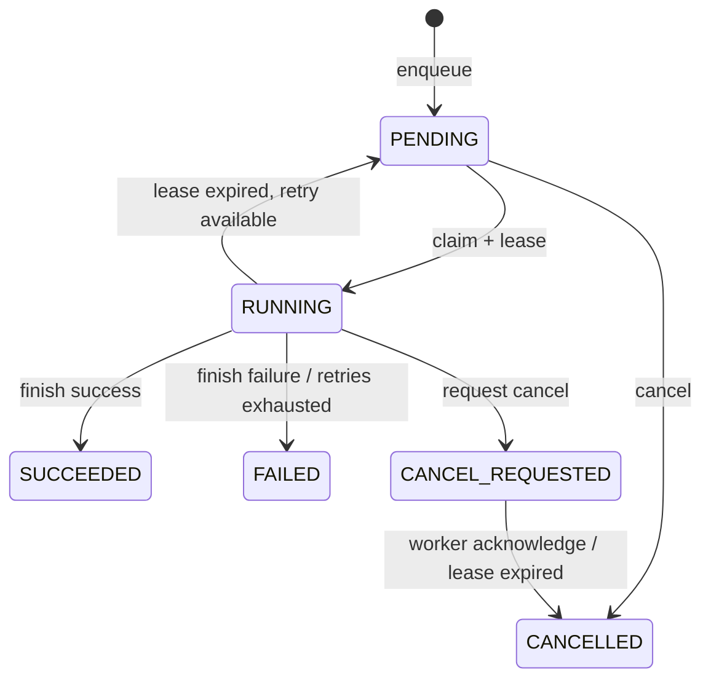

# CoreCoder 持久化任务调度

## 1. 这一阶段解决什么问题

此前 CoreCoder 可以完成一次 Coding 任务，但进程崩溃后，内存里的任务状态会丢失。多个 Worker 同时运行时，也需要避免同一个任务被重复领取。

持久化任务层解决：

- 任务提交后即使程序重启也能查询。
- 多个 Worker 原子竞争，只有一个能领取任务。
- Worker 必须定期续租，失联任务可以被回收。
- 重试次数有上限，避免故障任务无限循环。
- 运行中取消采用请求与确认两阶段。
- 只有持有租约的 Worker 能续租、完成或确认取消。

## 2. 状态机



终态 `SUCCEEDED`、`FAILED`、`CANCELLED` 不允许再次完成或取消。

## 3. 为什么需要租约

如果只把任务改为 `RUNNING`，Worker 在执行中崩溃后，任务会永远卡在运行状态。租约为任务增加一个到期时间：

1. Worker 领取任务并获得 60 秒租约。
2. 后台心跳定期延长到期时间。
3. Worker 崩溃后不再续租。
4. 回收器发现租约过期。
5. 未达到最大尝试次数则重新入队；否则标记失败。

租约解决的是“无法准确判断远程进程是否死亡”问题。系统不需要永久相信某个 Worker，只在有限时间内相信它。

## 4. 如何防止重复领取

SQLite 领取操作使用 `BEGIN IMMEDIATE` 事务：先获取写锁、回收过期租约、选择最早待处理任务，再更新为运行状态并提交。

测试中 8 个线程同时领取同一个任务，只有一个获得任务，其余返回空。这比“先查询 pending，再 update”可靠，因为后者在查询与修改之间存在竞争窗口。

## 5. 为什么暂时选择 SQLite

当前项目是单机学习与演示场景。SQLite 具备：

- Python 标准库直接支持。
- 无需部署额外服务。
- 支持事务、索引和 WAL。
- 数据可以跨进程和重启保留。
- 很适合验证任务状态机和租约语义。

Redis 并不是不能用，而是当前没有多机吞吐需求。未来多个节点部署时，可以把 `TaskStore` 接口替换为 Redis Streams、消息队列或数据库任务表；状态机、租约和幂等思想仍然适用。

## 6. 两阶段取消

待执行任务没有 Worker，可以直接从 `PENDING` 进入 `CANCELLED`。

运行中任务不能由控制面假装已经停止：

1. 控制面设置 `CANCEL_REQUESTED`。
2. Worker 在工具调用边界检查取消状态。
3. Worker 停止后调用 `acknowledge_cancel`。
4. 任务进入 `CANCELLED`。

如果 Worker 已崩溃，取消请求会在租约过期回收时变为取消完成。

## 7. 与 Coding Agent 的连接

`DurableCodingWorker` 的完整路径：

1. 从 `TaskStore` 原子领取一条 `coding` 任务。
2. 启动后台租约心跳线程。
3. 从 payload 读取任务说明和工作区。
4. 创建全新的 Agent，避免不同任务上下文污染。
5. 使用 `CodingTaskRunner` 完成代码修改与测试闭环。
6. 将状态、测试次数、修改文件和最终回复写回 SQLite。
7. 停止心跳线程。

非法 payload 或不支持的任务类型不会让 Worker 进程崩溃，而会形成带原因的 `FAILED` 记录。

## 8. 如何运行

离线完整演示：

```powershell
.\.venv\Scripts\python.exe examples\durable_task_demo.py
```

任务 CLI：

```powershell
corecoder-task enqueue --task "检查并修复测试" --workspace .
corecoder-task list
corecoder-task cancel <task_id>
corecoder-task recover
```

`.corecoder/tasks.db` 位于已被 Git 忽略的运行目录中。

## 9. 测试覆盖

- 跨 `TaskStore` 实例恢复数据。
- 8 Worker 并发原子领取。
- 租约续期的 Worker 所有权。
- 过期后重新入队。
- 达到最大次数后失败。
- 待处理任务立即取消。
- 运行任务两阶段取消。
- 非租约 Worker 禁止完成任务。
- Worker 执行结果持久化。
- payload 校验和未知任务类型失败。
- CLI 入队、查询、取消和回收。

## 10. 面试表达

针对 Coding Agent 进程重启丢失任务、多个 Worker 重复消费和执行中失联的问题，我基于 SQLite 实现了持久化任务台账。Worker 使用事务原子领取任务，通过租约心跳维持所有权；租约过期后按最大尝试次数重新入队或失败。运行中取消采用请求与 Worker 确认两阶段，并限制只有租约持有者能够续租和提交结果。在单机场景先用 SQLite 控制复杂度，同时保留未来替换 Redis Streams 或消息队列的边界。

## 11. 当前局限

- SQLite 适合单机，不适合大量跨主机 Worker 高并发写入。
- Worker 只能在工具调用边界感知取消，不能立即中断所有第三方工具。
- 心跳故障目前保留在 Worker 内部，后续应接入指标和告警。
- 任务结果仍保存模型最终文字，生产环境需要大小限制与更严格脱敏。
- 尚未实现租户配额和独立死信队列。

## 12. 幂等提交与优先级

调用方可能因网络超时重复提交同一个任务。仅依赖客户端“不重试”不可靠，因此入队接口支持 `idempotency_key`，并由 SQLite 唯一索引保证并发条件下也只产生一条任务。

如果同一幂等键携带不同任务内容，系统会拒绝请求，避免一个 Key 被错误复用。任务优先级限制在 -100 到 100，Worker 按优先级降序、创建时间升序领取，兼顾紧急任务与同级先来先服务。

CLI 示例：

```powershell
corecoder-task enqueue --task "修复生产问题" --workspace . --priority 50 --idempotency-key INC-2026-001
```

数据库使用 `PRAGMA user_version` 标记 Schema 版本。旧版任务表启动时自动增加幂等键和优先级字段，并保留已有任务；自动测试覆盖了旧表迁移。
